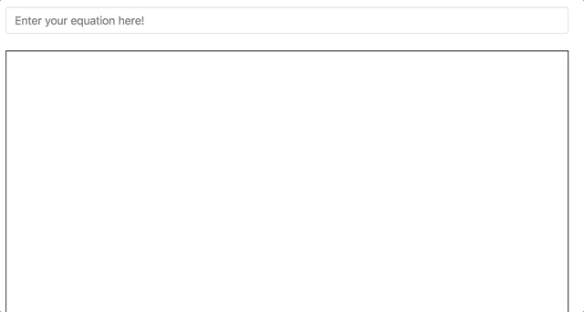

# CanvasLatex

Bringing quick math-typesetting rendering to the canvas

## Try it yourself

`npm install`

`npm start`

## The Commands

To see a basic list of supported commands, it's recommended to look in `test/selenium/expressions.yml`. If you want to see their rendered results, you can do so by either running the tests, or by copy/pasting into the input field when the server is running.

This project is built on top of the open-source project [KaTeX](https://github.com/Khan/KaTeX/). You can find a full list of their supported functions here: <https://khan.github.io/KaTeX/function-support.html>. Please not that not all are supported yet.

## Renderers

CanvasLatex is written in a way which should support any Canvas based renderer. The NodeBuilder creates "VirtualCanvasNodes" which are renderer agnostic models.

**Currently supported renderers include:**

1. CreateJS

2. PixiJS

**Future renderer support could include:**

1. ThreeJS (3D rendering?)

2. Node Canvas

3. FabricJS

4. Raw Canvas

## API

### Constructor

`const widget = new Widget(latex: string, options: object)`

#### Options

|       Name       |    Type     | Default  | Description                                                                                                                                                                                                                                                                                                                                                                                                                                                                                                                                                                                                           |
| :--------------: | :---------: | :------: | :-------------------------------------------------------------------------------------------------------------------------------------------------------------------------------------------------------------------------------------------------------------------------------------------------------------------------------------------------------------------------------------------------------------------------------------------------------------------------------------------------------------------------------------------------------------------------------------------------------------------- |
|     baseSize     | `{Integer}` |   `44`   | The base font size for the latex rendering. Note: This may be larger/smaller depending on the specific latex (i.e. an exponent will render in a smaller font.                                                                                                                                                                                                                                                                                                                                                                                                                                                         |
|   displayMode    | `{Boolean}` | `false`  | If true the math will be rendered in display mode, which will put the math in display style (so \int, \frac and \sum are large, for example)                                                                                                                                                                                                                                                                                                                                                                                                                                                                          |
|   debugBounds    | `{Boolean}` | `false`  | Displays a rectangle around the Widget's bounds.                                                                                                                                                                                                                                                                                                                                                                                                                                                                                                                                                                      |
| defaultTextColor | `{String}`  | `black`  | Allows the default text color to be changed by specifying a string (e.g. yellow) or a hex value.                                                                                                                                                                                                                                                                                                                                                                                                                                                                                                                      |
|      macros      | `{Object}`  |   `{}`   | A collection of custom macros. Each macro is a property with a name like \name (written "\\name" in JavaScript) which maps to a string that describes the expansion of the macro. Single-character keys can also be included in which case the character will be redefined as the given macro (similar to TeX active characters). The property name can map to either a string, or a function which contains a "context" argument. Example: `macros: { "\\RR": "\\mathbb{R}"}`                                                                                                                                        |
|      strict      | `{Boolean}` |  `warn`  | If `false` or `"ignore`", allow features that make writing LaTeX convenient but are not actually supported by (Xe)LaTeX (similar to MathJax). If `true` or `"error"` (LaTeX faithfulness mode), throw an error for any such transgressions. If `"warn"` (the default), warn about such behavior via `console.warn`. Provide a custom function `handler(errorCode, errorMsg, token)` to customize behavior depending on the type of transgression (summarized by the string code `errorCode` and detailed in `errorMsg`); this function can also return `"ignore"`, `"error"`, or `"warn"` to use a built-in behavior. |
|    sizeIndex     | `{Number}`  |   `6`    | The default size index for the fonts. The size mapping is as follows: [ null, 0.5, 0.6, 0.7, 0.8, 0.9, 1.0, 1.2, 1.44, 1.728, 2.074, 2.488 ]. The numbers represent the scale factors applied to fonts. A number of 6 maps to 1.0, a number of 7 maps to 1.2, etc.                                                                                                                                                                                                                                                                                                                                                    |
|    alignment     | `{String}`  | `center` | The default alignment when using newlines (\newline, \\, etc.). Options are 'center', 'left', 'right'.                                                                                                                                                                                                                                                                                                                                                                                                                                                                                                                |

#### Methods

|           Method           |       Args       |         Return Value          | Description                                                                                                                                                                                                                                                                                                                                                                                               |
| :------------------------: | :--------------: | :---------------------------: | :-------------------------------------------------------------------------------------------------------------------------------------------------------------------------------------------------------------------------------------------------------------------------------------------------------------------------------------------------------------------------------------------------------- |
|     getObjectsByClass      | `name: {String}` |    `Array<DisplayObject>`     | Returns a flattened 1d array of all createjs.DisplayObject's with the specified className. For example, when calling getObjectsByClass('a') with the latex: `\class{a}{ab} \class{a}{c}`, the return value will be a 1d array with "a" at index 0, "b" at index 1, and "c" in index 2. The array indexes are not distinguishable based on how they appear in the latex, and thus should not be relied on. |
| getObjectsByClassSeparated | `name: {String}` | `Array<Array<DisplayObject>>` | Returns a 2d array of createjs.DisplayObject's separated by their className. For example, when calling getObjectsByClassSeparated('a') with the latex: `\class{a}{ab} \class{a}{c}`, the return value will be a 2d array with ["a", "b"] at index 0 and ["c"] at index 1. The return values are distinguishable based on how they appear separated in the latex, and can be relied on as such.            |

#### Properties

|       Method       | Type  | Description                                                  |
| :----------------: | :---: | :----------------------------------------------------------- |
|       latex        | `get` | Returns the latex value as a string                          |
|       latex        | `set` | Re-renders with the given latex value                        |
|      classes       | `get` | Gets a full list of classes applied to the widget            |
| distanceToBaseline | `get` | Gets the distance to the baseline from the top of the widget |

## Fonts

### Loading the Fonts

Since canvas doesn't load fonts automatically, you can use the `WebFontLoader`. See `demo/demo.js` for an example. Additionally you'll need to make sure the fonts are available via the css. We leverage Katex's CSS file as it contains the fonts we need. You can use their CDN here: <https://cdnjs.com/libraries/KaTeX>. Or, you can include the fonts locally.

## License

CanvasLatex is licensed under the MIT License. <https://opensource.org/licenses/MIT>
